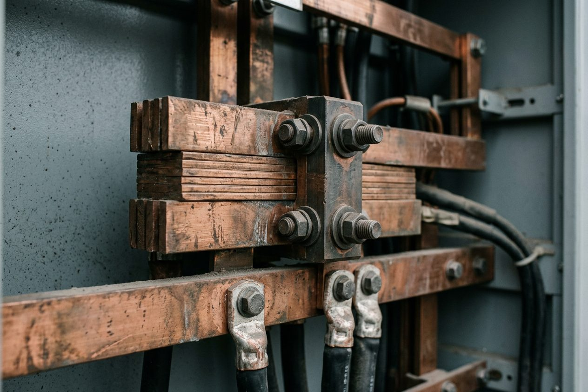

> 关于铜的讨论总是停在价格上，但铜真正稀缺的从来不是吨数，而是它能不能被送到需要电的地方。

## 排在银后面的那一个

所有导体里，银的导电性最好，铜排第二。这个名次看起来很委屈，实际上决定了整个现代工业的选择——银太贵，铝的导电率只有铜的六成左右，于是但凡需要把电稳稳送进一个柜子、一台设备、一间机房的地方，最后都会回到铜。

铜排不漂亮，但它身上几乎写着所有工程的妥协：接触面要镀锡，螺栓要按扭矩拧，氧化层要用砂纸磨掉再涂导电膏。这些动作都没有专利，也都不出现在任何一份发布会上。

## 从矿山到机柜，中间隔着一整条链

矿在山里，机柜在城里，这中间是选矿、冶炼、精炼、连铸连轧、拉丝、压延、镀锡、物流、库存。链条上任何一环卡住，价格都会先动，而真正需要用铜的人只能等着。

::: note 口径
本篇只讲材料的物理约束与工程常识，不涉及具体价格与产量数据；不同来源的统计口径差异很大，需要引用时请以最新披露为准。
:::

这也是材料生意和互联网生意最不一样的地方：它的瓶颈永远不在需求侧，而在物理世界里那几道磨不掉、也绕不开的工序。

## 把电送到位置

同样的道理，在电网上放大一遍。输电走廊、变电站、开关柜、母线、一直到机柜里的那一排铜排——电从发电侧走到算力侧，每一步都要有人把导体接上。

::: peak
电不缺，铜也不缺，缺的是把两者接在一起的那一段确定性。
:::

明白了这一点，就会理解为什么真正做基础设施的人很少谈概念，他们谈的是交期、镀层和扭矩。这些东西不好听，但它们决定了一台设备能不能在明天早上正常开机。
